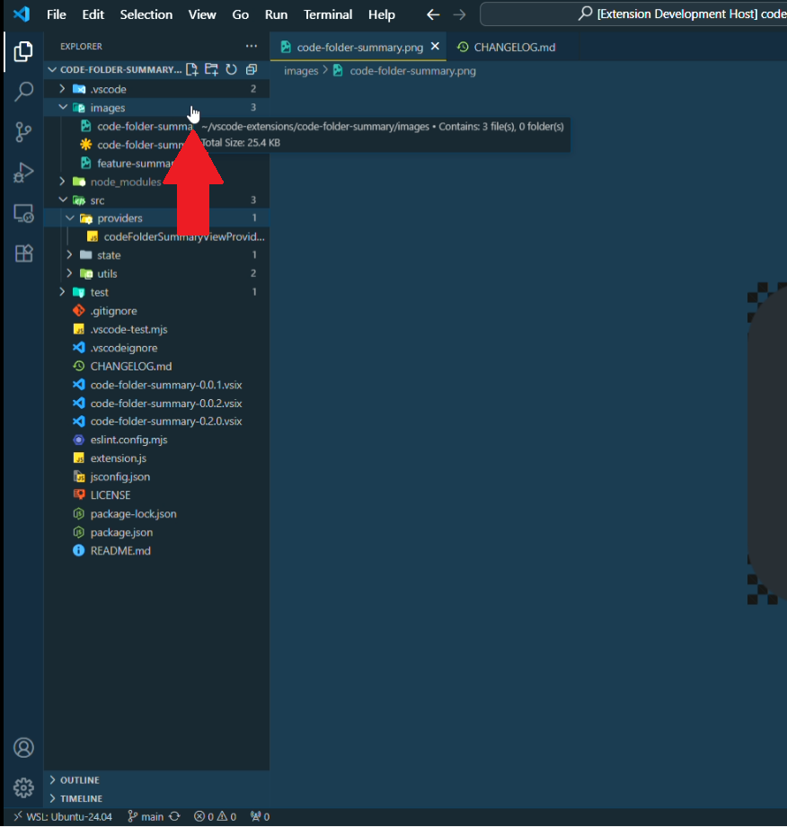

# File Size & Count VS Code Extension

Displays file sizes and folder item counts directly in the VS Code Explorer.  
- Shows the number of files/folders and total size for each folder.
- Ignores common folders like `.git` and `node_modules` for size calculations.

## Example

## Features

- **File Size:** See the size of each file in the explorer.
- **Folder Count:** See the number of files and folders inside each directory.
- **Folder Size:** See the total size of each folder (excluding ignored folders).
- **Performance:** Ignores hidden and dependency folders for fast calculations.

## Usage

- Open the Explorer view in VS Code.
- File sizes and folder counts will appear automatically.
- Hover over badges/labels for more details.

## Known Issues

- Large folders may take time to calculate size.
- Folder size next to each folder name is not working.
- sometimes source control hijacks the badges and tooltip.

## Upcoming Features

- Configurable skip folders (e.g., allow users to specify which folders to ignore).
- File size and date modified on activity bar.

## Release Notes

### 0.1.0

- Improved badge and tooltip text for files and folders.
- Smarter pluralization and hiding of zero-counts.

See [CHANGELOG.md](./CHANGELOG.md) for details.

## License

[MIT](./LICENSE)